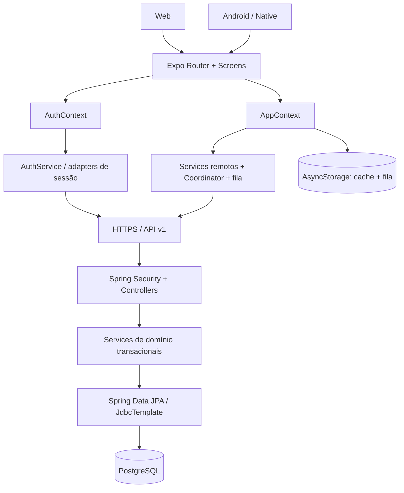

# Arquitetura

## Visão atual

**IMPLEMENTADO.** O frontend é um cliente do estado oficial, não a autoridade.

## Responsabilidades

- **Expo Router/Screens:** navegação, formulário, feedback e acessibilidade.
- **AuthContext:** estados de autenticação e troca obrigatória de senha.
- **AppContext:** snapshot reativo, estado de sincronização e operações da conta.
- **Services locais de domínio:** validações e helpers sem HTTP/UI/storage.
- **Services remotos:** convertem modelos em DTOs e chamam o Coordinator.
- **OperacaoRemotaCoordinator:** serializa POST/snapshot, controla revisão e
  respostas ambíguas.
- **FilaComandosService:** persiste intenções offline e processa por usuário.
- **Controllers:** borda HTTP e validação estrutural.
- **Services backend:** regras, locks, atomicidade, auditoria e revisão.
- **Repositories:** acesso JPA; `JdbcTemplate` é usado no advisory lock.
- **PostgreSQL:** estado oficial, histórico, autenticação e idempotência.

## Evolução da autoridade

O projeto começou como cliente local: `Screens → AppContext → Services →
AsyncStorage`. Isso permitiu prototipar regras e persistir um único dispositivo,
mas não resolvia concorrência, compartilhamento Rodrigo/Cesar, auditoria nem
confirmação inequívoca de operações.

A arquitetura evoluiu para `cliente → backend → PostgreSQL`. O AsyncStorage
continua útil como cache e fila, enquanto o backend passou a arbitrar identidade,
transações e idempotência. Esse desenho aceita leitura offline sem criar duas
fontes oficiais concorrentes.

## Decisões e trade-offs

- snapshot completo simplifica reconciliação, mas o histórico crescerá;
- revisão global é simples e segura para carga baixa, mas serializa avanços;
- advisory lock por comando evita duplicação sem infraestrutura adicional, mas
  cria dependência direta de PostgreSQL;
- um único backend/rate limiter em memória atende a fase atual; múltiplas
  réplicas exigiriam estado compartilhado (**FUTURO**);
- arquitetura provider-agnostic mantém portabilidade; deploy público é
  **PLANEJADO**.
