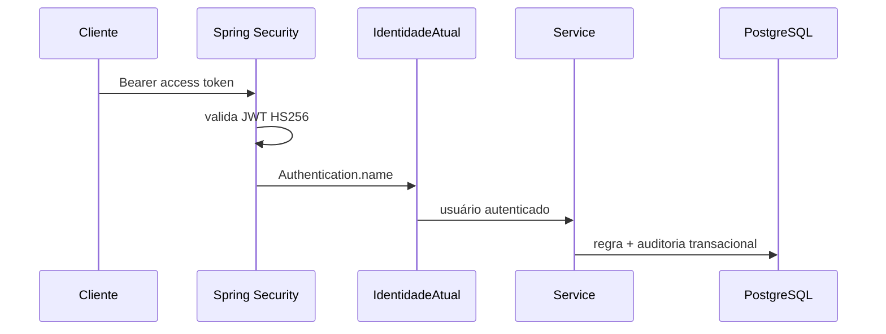

# Autenticação e segurança

## Fluxo de identidade



O backend usa Spring Security stateless, BCrypt com custo 12, JWT HS256 e
refresh tokens aleatórios armazenados no banco somente como hash. Rodrigo/Cesar
são criados pelas migrations; o bootstrap recebe senhas iniciais por secrets do
ambiente, gera hashes e marca a troca obrigatória conforme configuração.

## Access e refresh

O access token é curto e enviado como Bearer. O refresh token tem duração maior,
é rotacionado a cada renovação; a sessão anterior é revogada e ligada à nova.
Logout revoga a sessão refresh. A troca de senha revoga todas as sessões do
usuário e exige novo login.

### Web

- access token: memória JavaScript;
- refresh token: cookie HttpOnly, host-only, `Secure` em produção e política
  `SameSite` configurável;
- endpoints `/auth/web/*` exigem `Origin` explicitamente permitido e usam
  `credentials: include`.

### Native/Android

- access token: memória;
- refresh token: `expo-secure-store` por meio do adapter nativo;
- endpoints `/auth/login|refresh|logout` rejeitam requests com `Origin` de
  navegador.

A diferença reduz a exposição do refresh token: JavaScript Web não consegue ler
cookie HttpOnly; no dispositivo nativo não há cookie de navegador confiável, por
isso usa armazenamento seguro do sistema.

## Autoridade do responsável

`responsavelId` deixou de ser autoridade nos requests remotos. O cliente remove
esse campo da fila e o backend deriva a identidade assim:

```text
JWT → Authentication → IdentidadeAtual → Service → registro/auditoria
```

Isso impede Rodrigo de enviar um corpo declarando Cesar (e vice-versa).

## Controles implementados

- rate limiting de login por IP/login e refresh por IP, local à JVM;
- CORS com allowlist e credenciais;
- validação separada de transporte Web/Native;
- `Cache-Control: no-store`, HSTS em HTTPS, proteção contra framing, MIME
  sniffing e referrer leakage;
- `X-Request-Id` seguro e logs sem tokens, bodies ou headers sensíveis;
- body padrão limitado a 1 MiB e operações a no máximo 50 itens;
- respostas de erro controladas com código e request ID; erro inesperado não
  expõe stack trace ou segredo;
- configuração de produção falha se DB/JWT secret estiver ausente ou se cookie
  seguro estiver inconsistente.

O rate limiter compartilhado e blacklist imediata de access tokens são
**FUTURO** caso existam múltiplas réplicas ou requisito de revogação instantânea.
