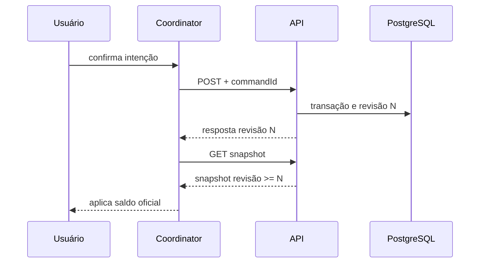
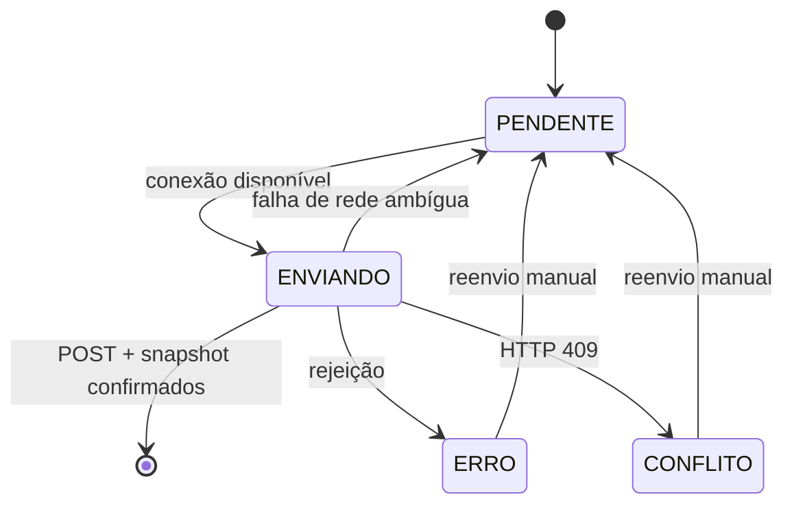
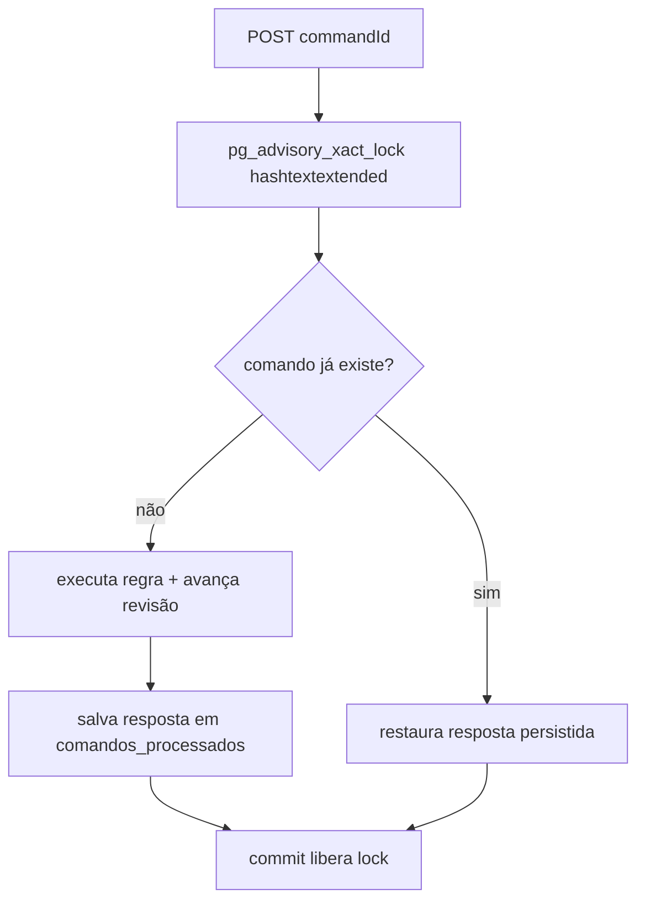

# Offline, sincronização e idempotência

## Snapshot e revisão

O `GET /api/v1/snapshot` lê o estado oficial em transação `REPEATABLE_READ` e
retorna estoques, reservas e históricos junto da revisão global. O cliente
mapeia esse DTO para `DadosIniciais`, guarda a maior revisão aplicada e salva o
snapshot validado no AsyncStorage.



## Por que não há alteração otimista do saldo

Uma operação offline pode ser inválida quando chegar ao servidor: outra conta
pode ter consumido saldo, protegido uma reserva ou alterado a revisão. Se o
cliente diminuísse/aumentasse o saldo local imediatamente, mostraria um estado
que talvez nunca tenha existido e depois precisaria desfazer efeitos e
históricos relacionados.

Por isso a fila registra **intenção**, não um novo saldo. O usuário continua
vendo o último snapshot confirmado e uma faixa explícita de pendência. Somente
um snapshot oficial posterior à confirmação atualiza a UI.

## Fila persistente

Cada comando contém `commandId`, `usuarioIdCriador`, tipo, payload, data,
tentativas e status. Estados do modelo:

- `PENDENTE`: aguarda envio/reenvio;
- `ENVIANDO`: POST em curso ou confirmação aguardando snapshot;
- `CONFIRMADO`: previsto no formato persistido, removido da fila após aplicação;
- `ERRO`: rejeição que permite revisão/reenvio/descarte;
- `CONFLITO`: HTTP 409; intenção precisa ser revista;
- `REQUER_ATENCAO`: comando legado sem criador confiável ou situação que não
  pode ser enviada automaticamente.

Ao carregar, um `ENVIANDO` interrompido volta a `PENDENTE`. A fila só processa
comandos cujo `usuarioIdCriador` corresponde à sessão atual. Trocar Rodrigo por
Cesar não transfere nem envia intenções da outra pessoa.



## Falhas e reconciliação

- **falha antes/durante POST:** não é possível saber se o servidor recebeu;
  mantém o comando e reutiliza o mesmo ID;
- **POST confirmado, snapshot falha:** marca estado desatualizado, bloqueia nova
  operação e tenta somente obter o snapshot;
- **snapshot com revisão menor:** rejeita como desatualizado;
- **erro HTTP:** não é ambíguo; vira erro/conflito conforme o status;
- **reconexão:** a inicialização busca snapshot, processa a fila em ordem e
  reconcilia novamente.

Regra central:

```text
mesma intenção → mesmo commandId
nova intenção  → novo commandId
```

## Idempotência no PostgreSQL



O lock é transacional e calculado do UUID. Duas requisições concorrentes do
mesmo usuário/mesma operação serializam; a segunda restaura a resposta. Outro
usuário recebe 403 e outro tipo de operação não pode reutilizar o ID. Rollback
descarta estoque, revisão e comando e libera o lock para nova tentativa.

### Exemplo

O celular envia retirada `abc`, perde a rede após o servidor confirmar e mantém
`abc` pendente. No retry, o backend encontra `abc` e devolve a resposta original;
não há segunda retirada. Se o usuário criar uma retirada diferente, o cliente
gera outro UUID.
