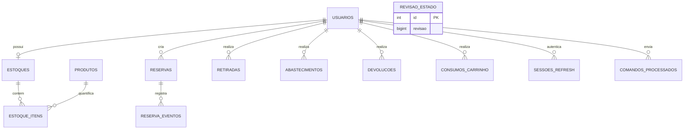

# Banco de dados

## Papel do PostgreSQL

PostgreSQL é a fonte oficial de estoque, reservas, históricos, revisão,
identidade e sessões. AsyncStorage não o substitui: é cache potencialmente
desatualizado e fila de intenções de um dispositivo. O banco permite transações
entre vários itens, concorrência entre Rodrigo/Cesar, auditoria e recuperação.

## Modelo simplificado



Tabelas de cabeçalho têm tabelas de itens/saldos relacionadas para retiradas,
abastecimentos, devoluções, movimentos do Principal e consumos. Isso preserva
uma operação agregada e seus detalhes.

## Flyway V1–V15

| Versão | Entrega |
| --- | --- |
| V1–V2 | usuários, produtos, estoques, itens e seed |
| V3 | retiradas e itens |
| V4 | reservas e eventos |
| V5 | abastecimentos, itens e saldos |
| V6 | devoluções, parcelas e liberação de reserva |
| V7 | movimentos do Estoque Principal |
| V8 | consumos do carrinho |
| V9 | separação entre destino lógico e mercado físico |
| V10 | revisão global |
| V11 | comandos processados |
| V12 | login, hash e estado do usuário |
| V13 | sessões refresh |
| V14 | comando/Movimento Principal vinculados ao usuário; leitura `jsonb` |
| V15 | troca obrigatória e índices de retenção |

Migrations publicadas nunca são editadas. A próxima mudança de schema começa em
V16+. O Spring/Flyway migra automaticamente no startup antes da validação JPA;
não se aplica migration manualmente fora da aplicação.

## Concorrência e recursos PostgreSQL

- `@Transactional` mantém cada operação atômica;
- `PESSIMISTIC_WRITE` protege estoque, reservas, revisão e sessão quando
  necessário;
- snapshot usa `REPEATABLE_READ` para uma visão coerente;
- `pg_advisory_xact_lock(hashtextextended(...))` serializa o mesmo `commandId`;
- `jsonb` foi usado na V14 para migrar auditoria de respostas existentes;
- constraints impedem quantidades/saldos negativos e duplicatas relevantes.

A conexão de produção deve ser direta, sem PgBouncer nesta fase, por causa do
uso consciente de advisory locks transacionais.

## Retenção e crescimento

O cleanup diário remove sessões expiradas/revogadas antigas e comandos além das
janelas configuradas. Históricos, movimentos e eventos ainda crescem sem
retenção; monitoramento, paginação e snapshots incrementais são **FUTURO**, não
implementados agora.

## Backup e restore

Produção exige backup diário, retenção mínima de sete dias e restore periódico
em banco separado. Exemplo seguro:

```bash
pg_dump "$DATABASE_URL" --format=custom --no-owner --no-privileges \
  --file=/caminho-seguro/stockflow.dump
pg_restore --dbname="$RESTORE_DATABASE_URL" --clean --if-exists \
  --no-owner --no-privileges /caminho-seguro/stockflow.dump
```

`backend/scripts/test-backup-restore.sh` automatiza localmente banco A, dado
marcador, dump, banco B, restore, Flyway/readiness e restart, sem guardar o dump
no repositório.
