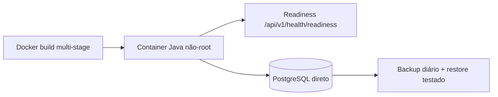
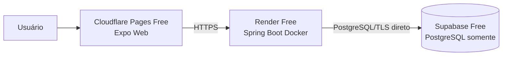

# Infraestrutura e deploy

## Implementado

- Java 21 e Spring Boot empacotados em Docker;
- Dockerfile multi-stage: Maven/JDK no build e JRE Alpine no runtime;
- processo não-root UID/GID 10001 e heap limitado por porcentagem;
- `compose.yaml` local com PostgreSQL 17 persistente e healthchecks;
- Flyway automático e JPA `ddl-auto=validate`;
- readiness que verifica inicialização, conexão e migrations pendentes;
- Hikari pequeno: máximo 5, mínimo idle 1, timeouts externalizáveis;
- configuração do profile `prod` totalmente por environment/secrets;
- teste reproduzível de backup, restore e restart.

Variáveis essenciais: `SPRING_PROFILES_ACTIVE=prod`, `DB_URL`, `DB_USERNAME`,
`DB_PASSWORD`, `AUTH_JWT_SECRET` e `CORS_ALLOWED_ORIGINS`. O primeiro banco exige
temporariamente `AUTH_INITIAL_PASSWORD_RODRIGO` e
`AUTH_INITIAL_PASSWORD_CESAR`; removê-las após hashes confirmados e troca das
senhas. Pool, cookie, tokens, rate limit, retenção e limite HTTP também são
configuráveis — consultar `backend/src/main/resources/application.yml`.

Conexão pública ao banco exige TLS com validação (`sslmode=verify-full`) e CA do
provedor montada como secret quando necessária. Preferir rede privada e mesma
região. Não versionar certificado privado nem usar PgBouncer nesta fase.

## Deploy planejado: stack Free

Tudo neste diagrama é **PLANEJADO**, ainda não criado/validado publicamente:

- Cloudflare Pages Free para o Web;
- Render Free para o backend Docker;
- Supabase Free somente como PostgreSQL.

Não usar Supabase Auth; Spring Security/JWT continua sendo a arquitetura de
autenticação. Antes de criar recursos, confirmar regiões, limites, conexão TLS,
backup/retenção e restore do plano. Cold start do Render é risco planejado, não
comportamento atualmente medido.

## Operação de banco

Requisito mínimo: backup automático diário, sete dias de retenção, restore em
instância separada e dump lógico antes de mudanças relevantes. O backend falha
fechado se credenciais/Flyway impedirem startup e volta a ready após a
infraestrutura saudável. Não existe deploy público definitivo nesta fase.
