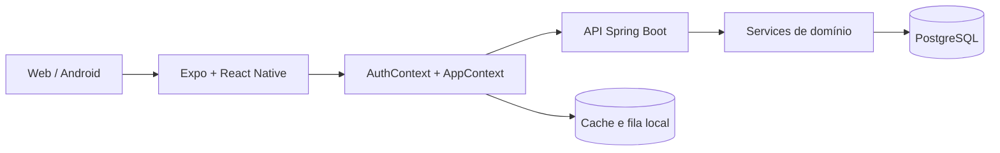

# Documentação oficial do StockFlow

O StockFlow controla estoques de pelúcias e insumos, reservas e abastecimentos
dos pontos operados por Rodrigo e Cesar. Ele substitui controles dispersos por
um estado oficial compartilhado, histórico auditável e operações seguras mesmo
quando a conexão do cliente oscila.

**Estado atual — IMPLEMENTADO:** cliente Expo/React Native para Web e Android,
backend Spring Boot/Java 21, autenticação JWT, cache e fila offline, PostgreSQL,
Flyway V1–V15, Docker, testes de integração e procedimento de backup/restore.
O banco gerenciado e o deploy público permanecem **PLANEJADOS**.

## Trilha usuário

1. [Manual do usuário](01-manual-do-usuario.md)
2. [Regras de negócio](02-regras-de-negocio.md)
3. [Troubleshooting](13-troubleshooting.md)

## Trilha técnica

1. [Arquitetura](03-arquitetura.md)
2. [Backend e API](07-backend-api.md)
3. [Banco de dados](06-banco-de-dados.md)
4. [Autenticação e segurança](04-autenticacao-e-seguranca.md)
5. [Offline, sincronização e idempotência](05-offline-sincronizacao-idempotencia.md)
6. [Frontend Mobile e Web](08-frontend-mobile-web.md)
7. [Infraestrutura e deploy](09-infraestrutura-e-deploy.md)
8. [Testes e qualidade](10-testes-e-qualidade.md)
9. [Histórico de desenvolvimento](11-historico-de-desenvolvimento.md)
10. [Guia de apresentação técnica](12-guia-de-apresentacao-tecnica.md)

Os documentos descrevem somente o comportamento confirmado no código. Itens
marcados como **PLANEJADO** ou **FUTURO** ainda não estão disponíveis.
**IMPLEMENTADO** significa disponível no código atual; **DEPRECIADO** identificará
algo ainda presente apenas para compatibilidade e que não deve receber novas
dependências. No estado atual, não há funcionalidade de produto marcada como
depreciada.
